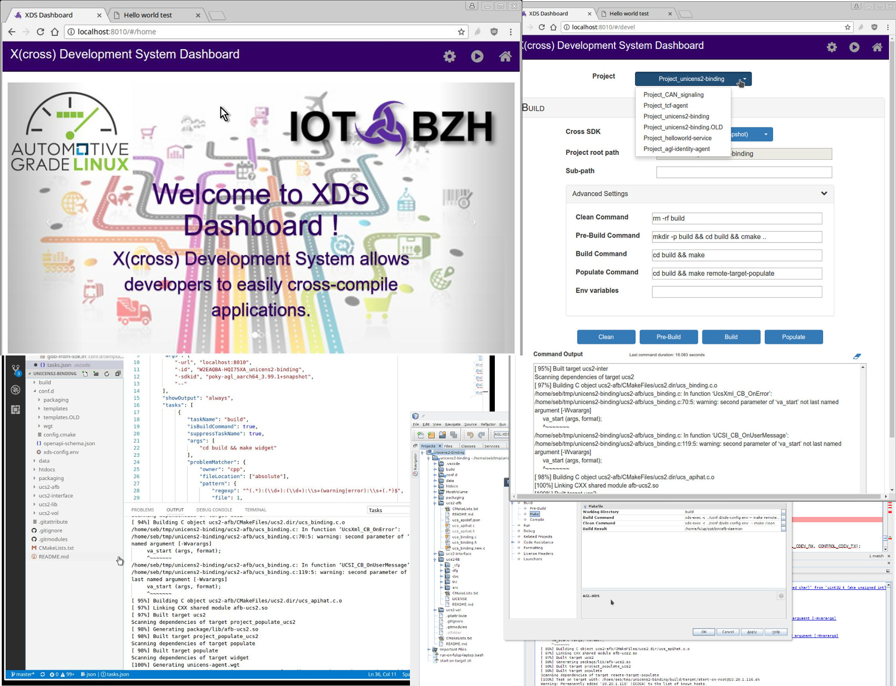
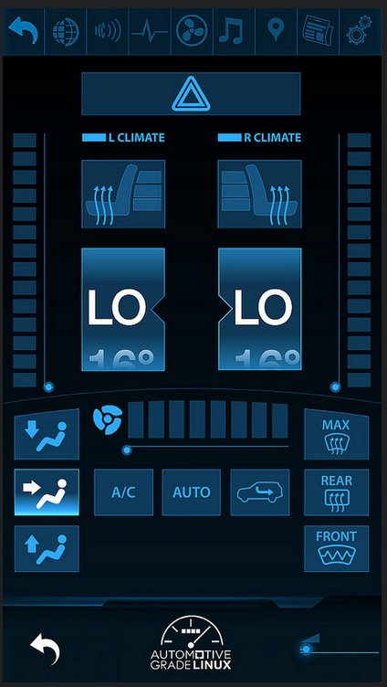

# Introduction

AGL Automotive Grade Linux Automotive Grade Linux is a collaborative open
source project that is bringing together automakers, suppliers and technology
companies to accelerate the development and adoption of a fully open software
stack for the connected car.

AGL XDS X(cross) Development System (XDS) provides a multi-platform cross
development tool with near-zero installation.

* It was created for Automotive Grade Linux (AGL) but can be for other purposes
* xds-agent: a tool that must run on user host machine to be able to use XDS.
* xds-exec : a wrapper on linux exec command that can be use to execute any command on a remote XDS server.

The AGL application framework on top of the security
framework provides the components to install and uninstall applications and to run it in a secured environment.

CANdevStudio is a CAN bus simulation software. It can work with variety of CAN
hardware interfaces (e.g. Microchip, Vector, PEAK-Systems) or even without it
(vcan and cannelloni) . CANdevStudio enables to simulate CAN signals such as
ignition status, doors status or reverse gear by every automotive developer.

| *Meta* | *Data* |
| -- | -- |
| **Title** | {{ config.title }} |
| **Author** | {{ config.author }} |
| **Description** | {{ config.description }} |
| **Keywords** | {{ config.keywords }} |
| **Language** | English |
| **Published** | Published {{ config.published }} as an electronic book |
| **Updated** | {{ gitbook.time }} |
| **Collection** | Open-source |
| **Website** | [{{ config.website }}]({{ config.website }}) |
