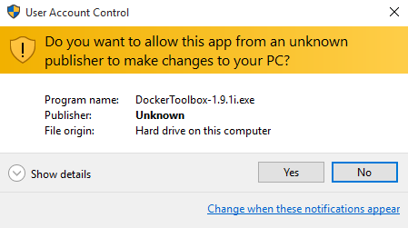
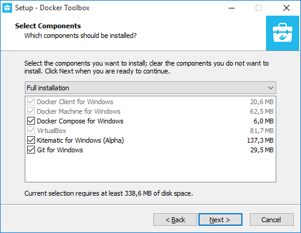
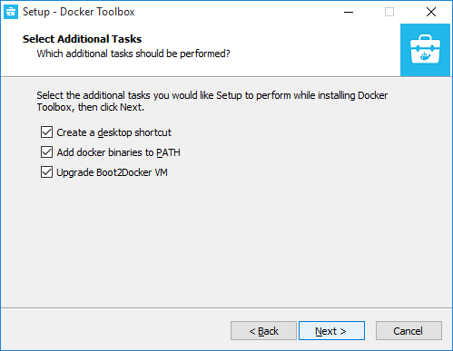
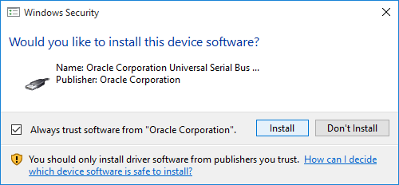
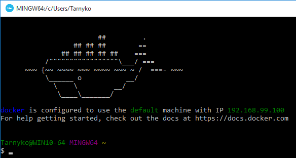
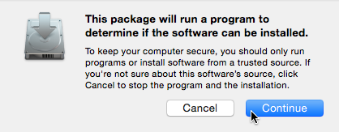
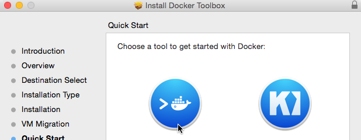
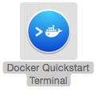
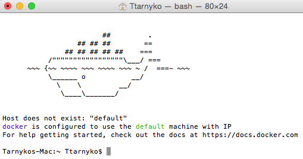
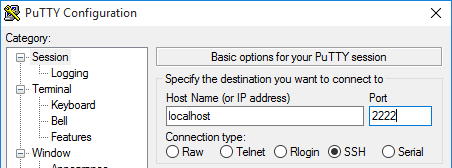

---
title :
---


Install AGL DevKit
==================

## Abstract

The AGL DevKit allows developers to rebuild a complete bootable image
and its associated SDK from source code. It uses Yocto/Poky version 2.x
with latest version of Renesas BSP and enables low-level development of
drivers and system services.

The AGL DevKit contains:
- This guide, which describes how to create a Docker container able to
  build AGL images and associated SDKs. The container is also suitable
  to build AGL Applications independently of Yocto/Bitbake.
- Applications templates and demos available on Github, to start
  developing various types of applications independently of Yocto:
  - services
  - native applications
  - HTML5 applications
  - ...

- A documentation guide "**AGL Devkit - Build your 1st AGL
  Application**" which explains how to use the AGL SDK to create applications
  based on templates.

*This document focuses on building from scratch an AGL image for Porter
board, within a Docker container, and then install the associated SDK.*

## Deploy an image using containers

### Motivation

The Yocto build environment is subject to many variations depending on:

-   Yocto/Poky/OpenEmbedded versions and revisions
-   Specific layers required for building either the BSP or the whole
    distribution
-   Host distribution and version [1]
-   User environment

In particular, some recent Linux host distributions (Ubuntu 15.x, Debian
8.x, OpenSUSE 42.x, CentOS 7.x) do not officially support building with
Yocto 2.0. Unfortunately, there's no easy solution to solve this kind of
problem: we will still observe for quite a long time a significant gap
between the latest OS versions and a fully certified build environment.

To circumvent those drawbacks and get more deterministic results amongst
the AGL community of developers and integrators, using virtualization is
a good workaround. A Docker container is now available for AGL images:
it is faster, easier and less error-prone to use a prepared Docker
container because it provides all necessary components to build and
deploy an AGL image, including a validated base OS, independently of the
user's host OS. Moreover, light virtualization mechanisms used by Docker
do not add much overhead when building: performances are nearly equal to
native mode.

[1] *The list of validated host distros is defined in the Poky distro, in
the file `meta-yocto/conf/distro/poky.conf` and also at [http://www.yoctoproject.org/docs/2.0/ref-manual/ref-manual.html#detailed-supported-distros](http://www.yoctoproject.org/docs/2.0/ref-manual/ref-manual.html#detailed-supported-distros)*


### Prerequisites

To run an AGL Docker image, the following prerequisites must be
fulfilled:

-   You must run a 64-bit operating system, with administrative rights,
-   Docker engine v1.8 or greater must be installed,
-   An internet connection must be available to download the Docker
    image on your local host.

## Setting up your operating system

In this section, we describe the Docker installation procedure depending
on your host system. We will be focusing on the most popular systems;
for a full list of supported operating systems, please refer to Docker
online documentation: [https://docs.docker.com/](https://docs.docker.com/)

### Linux (Ubuntu / Debian)

At the time of writing, Docker project supports these Ubuntu/Debian
releases:
-   Ubuntu Yakkety 16.10
-   Ubuntu Xenial 16.04 LTS
-   Ubuntu Trusty 14.04 LTS
-   Debian 8.0 (64-bit)
-   Debian 7.7 (64-bit)

For an updated list of supported distributions, you can refer to the
Docker project website, at these locations:

- [https://docs.docker.com/engine/installation/linux/debian/](https://docs.docker.com/engine/installation/linux/debian/)
- [https://docs.docker.com/engine/installation/linux/ubuntu/](https://docs.docker.com/engine/installation/linux/ubuntu/)

Here are the commands needed to install the Docker engine on your local
host:
```
$ sudo apt-get update
$ sudo apt-get install wget curl
$ wget -qO- https://get.docker.com/ | sh
```

This will register a new location in your "sources.list" file and
install the "docker.io" package and its dependencies:
```
$ cat /etc/apt/sources.list.d/docker.list
$ deb [arch=amd64] https://apt.dockerproject.org/repo ubuntu-xenial main
$ docker --version
Docker version 17.03.0-ce, build 60ccb22
```

It is then recommended to add your user to the new "docker" system
group:
```
$ sudo usermod -aG docker *<your-login>*
```
... and after that, to log out and log in again to have these credentials
applied.

You can reboot your system or start the Docker daemon using:
```
$ sudo service docker start
```

If everything went right, you should be able to list all locally
available images using:
```
$ docker images
REPOSITORY TAG IMAGE ID CREATED VIRTUAL SIZE
```

In our case, no image is available yet, but the environment is ready to
go on.

A SSH client must also be installed:
```
$ sudo apt-get install openssh-client
```

### Windows © (7, 8, 8.1, 10)

**WARNING: although Windows© can work for this purpose, not only are lots
of additional steps needed, but the build process performance itself is
suboptimal. Please consider moving to Linux for a better experience.**

We will be downloading the latest Docker Toolbox at the following
location:

[*https://www.docker.com/docker-toolbox*](https://www.docker.com/docker-toolbox)

and by clicking on the "*Download (Windows)*" button:


We will answer "Yes", "Next" and "Install" in the next dialog boxes.








We can then start it by double-clicking on the "Docker Quickstart
Terminal" icon:


It will take a certain amount time to setup everything, until this
banner appears:



Docker Toolbox provides a 1 Gb RAM/20 Go HDD virtual machine; this is
clearly insufficient for our needs. Let us expand it to 4 Gb RAM/50
HDD (*these are minimal values; feel free to increase them if your computer
has more physical memory and/or free space*) :
```
export VBOXPATH=/c/Program\ Files/Oracle/VirtualBox/
export PATH="$PATH:$VBOXPATH"

docker-machine stop default

VBoxManage.exe modifyvm default --memory 4096
VBoxManage.exe createhd --filename build.vmdk --size 51200 --format VMDK
VBoxManage.exe storageattach default --storagectl SATA --port 2 --medium build.vmdk --type hdd

docker-machine start default

docker-machine ssh default "sudo /usr/local/sbin/parted --script /dev/sdb mklabel msdos"
docker-machine ssh default "sudo /usr/local/sbin/parted --script /dev/sdb mkpart primary ext4 1% 99%"
docker-machine ssh default "sudo mkfs.ext4 /dev/sdb1"
docker-machine ssh default "sudo mkdir /tmp/sdb1"
docker-machine ssh default "sudo mount /dev/sdb1 /tmp/sdb1"
docker-machine ssh default "sudo cp -ra /mnt/sda1/* /tmp/sdb1"

docker-machine stop default

VboxManage.exe storageattach default --storagectl SATA --port 2 --medium none
VboxManage.exe storageattach default --storagectl SATA --port 1 --medium build.vmdk --type hdd

docker-machine start default
```

We will then finalize the setup:

```
VboxManage.exe modifyvm default --natpf1 sshredir,tcp,127.0.0.1,2222,,2222
docker-machine start default
docker-machine ssh default "echo mkdir /sys/fs/cgroup/systemd | sudo tee /var/lib/boot2docker/bootlocal.sh"
docker-machine restart default
```
A SSH client must also be installed. We will grab *PuTTY* at the
following URL:
[*http://the.earth.li/~sgtatham/putty/latest/x86/putty.exe*](http://the.earth.li/~sgtatham/putty/latest/x86/putty.exe)


### Mac OS X ©

We will be downloading the latest Docker Toolbox at the following
location:
[https://www.docker.com/docker-toolbox](https://www.docker.com/docker-toolbox)

and by clicking on the "*Download (Mac)*" button:


We will answer "Continue" and "Install" in the next dialog boxes:






Then, when we go to our "Applications" folder, we now have a "Docker"
subfolder where we can start "Docker Quickstart Terminal":



It will take a certain amount of time to setup everything, until this
banner appears:



Docker Toolbox provides a 1 Gb RAM/20 Go HDD virtual machine; this is
clearly insufficient for our needs. Let us expand it to 4 Gb RAM/50
HDD (*these are minimal values; feel free to increase them if your computer
has more physical memory and/or free space*) :
```
docker-machine stop default

VboxManage modifyvm default --memory 4096
VboxManage createhd --filename build.vmdk --size 51200 --format VMDK
VboxManage storageattach default --storagectl SATA --port 2 --medium build.vmdk --type hdd

docker-machine start default

docker-machine ssh default "sudo /usr/local/sbin/parted --script /dev/sdb mklabel msdos"
docker-machine ssh default "sudo /usr/local/sbin/parted --script /dev/sdb mkpart primary ext4 1% 99%"
docker-machine ssh default "sudo mkfs.ext4 /dev/sdb1"
docker-machine ssh default "sudo mkdir /tmp/sdb1"
docker-machine ssh default "sudo mount /dev/sdb1 /tmp/sdb1"
docker-machine ssh default "sudo cp -ra /mnt/sda1/* /tmp/sdb1"

docker-machine stop default

VboxManage storageattach default --storagectl SATA --port 2 --medium none
VboxManage storageattach default --storagectl SATA --port 1 --medium build.vmdk --type hdd

docker-machine start default
```

We will then finalize the setup:
```
VboxManage modifyvm default --natpf1 sshredir,tcp,127.0.0.1,2222,,2222
docker-machine ssh default "echo mkdir /sys/fs/cgroup/systemd | sudo tee /var/lib/boot2docker/bootlocal.sh"
docker-machine restart default
```


## Install AGL Yocto image for Porter board using Docker container

### Overview

This section gives details on a procedure which allows system developers
and integrators to set up a the build environment image on their local
host.

The prepared environment is deployed and available thanks to lightweight
virtualization containers using Docker technology
(See [https://www.docker.com/](https://www.docker.com/)).
The pre-built image for AGL development activities is currently designed to be
accessed using SSH Protocol.

### Download the docker image

At the time of writing, we distribute the image as a compressed archive
which can be downloaded faster as its footprint is around 226 MB. You
can then import it into Docker with the following command:
```
$ curl https://download.automotivelinux.org/AGL/snapshots/sdk/docker/docker_agl_worker-3.0.tar.xz | docker load
```

You can check that the new Docker image is available by running the
`docker images` command :
```
$ docker images
REPOSITORY                               TAG      IMAGE ID         CREATED         SIZE
docker.automotivelinux.org/agl/worker    3.0      18a6db4db383     2 months ago    925 MB
```

*Note*: if you want to rebuild from scratch this docker image, you should
use scripts located into `docker-worker-generator` repository.
```
$ git clone https://gerrit.automotivelinux.org/gerrit/AGL/docker-worker-generator
```
Then, please refer to `README.md` file for more details.


### Start the container
<a id="anchor-start-container"></a>

Once the image is available on your local host, you can start the
container and the SSH service. We'll also need a local directory on the
host to store bitbake mirrors (download cache and sstate cache): this
mirror helps to speed up builds.

First, create a local directory and make it available to everyone:
```
$ MIRRORDIR=<your path here, ~/mirror for example>;
$ mkdir -p $MIRRORDIR
$ chmod 777 $MIRRORDIR
```

Then we can start the docker image using the following command:
```
$ docker run \
 --publish=2222:22 \
 --publish=8000:8000 \
 --publish=69:69/udp --publish=10809:10809 \
 --detach=true --privileged \
 --hostname=bsp-devkit --name=bsp-devkit \
 -v /sys/fs/cgroup:/sys/fs/cgroup:ro \
 -v $MIRRORDIR:/home/devel/mirror \
 docker.automotivelinux.org/agl/worker:3.0
```
Then, you can check that the image is running with the following
command:
```
$ docker ps
CONTAINER ID        IMAGE                                       COMMAND                  CREATED               STATUS              PORTS                  NAMES
3126423788bd        docker.automotivelinux.org/agl/worker:3.0   "/usr/bin/wait_for..."   2 seconds ago         Up 2 seconds        0.0.0.0:2222->22/tcp, 0.0.0.0:69->69/udp, 0.0.0.0:8000->8000/tcp, 0.0.0.0:10809->10809/tcp bsp-devkit
```

The container is now ready to be used. A dedicated user has been
declared:
- login: **devel**
- password: **devel**

The following port redirections allow access to some services in the
container:
- port 2222: SSH access using `ssh -p 2222 devel@localhost`
- port 8000: access to Toaster WebUI through [http://localhost:8000/](http://localhost:8000/)
  when started (see Yocto documentation)
- ports 69 (TFTP) and 10809 (NBD): used for network boot (future enhancement)

For easier operations, you can copy your ssh identity inside the
container:
```
$ ssh-copy-id -p 2222 <devel@localhost>       # password is 'devel'
```

### Connect to Yocto container through SSH

The DevKit container provides a pre-built set of tools which can be
accessed through a terminal by using Secure Shell protocol (SSH).

#### Linux, Mac OS X ©

On Linux-based systems, you may need to install an SSH client.

To launch the session, you can enter the following under Linux or Mac OS X:
```
$ ssh -p 2222 devel@localhost
```
The password is "**devel**". You should obtain the following prompt
after success:
```
devel@localhost's password: **devel**

The programs included with the Debian GNU/Linux system are free
software; the exact distribution terms for each program are described in the
individual files in /usr/share/doc/*/copyright.

Debian GNU/Linux comes with ABSOLUTELY NO WARRANTY, to the extent
permitted by applicable law.
[11:28:27] devel@bsp-devkit:~$
```

#### Windows ©

You will need *PuTTY*, downloaded during the setup
section. Run it using its icon:


We can then connect to "l**ocalhost**" on port
"**2222**".



Credentials are the same as for Linux: user is "**devel**" with password
"**devel**".

### Set up a persistent workspace
<a id="anchor-setup-persist-wks"></a>

AGL Docker image brings a set of tools and here we describe a way to
prepare a "shared directory" on your local host accessible from the
container. The aim of this shared directory is to allow your ongoing
developments to stay independent from the container upgrades.

Please note this whole procedure is not mandatory, but highly
recommended as it will save disk space later when you will deploy the SD
card image on your target.

#### From Linux host using a shared directory

Current docker implementation has a limitation about UID:GID mapping
between hosts and containers. In the long run, the planned mechanism is
to use the "user namespace" feature. But for now, we propose another
approach unfortunately less flexible.

We can use a directory on the local host with a dedicated Unix group
using a common GID between the host and the container. This GID has been
fixed to "1664" ([see](https://en.wikipedia.org/wiki/Beer_in_France))
and can be created on your linux host using the following commands:
```
$ sudo groupadd --gid 1664 agl-sdk
$ sudo usermod -aG agl-sdk *<your-login>*
```
If this GID is already used on your local host, you will have to use it
for this sharing purpose as well. In case this is not possible, another
option to exchange workspace data can be the use of a network service
(like SSH, FTP) of the container and from your local host.

Once the GID is ready to use, we can create a shared directory (not as
'root', but as your normal user):
```
$ cd
$ mkdir $HOME/agl-workspace
$ sudo chgrp agl-sdk $HOME/agl-workspace
$ chmod ug+w $HOME/agl-workspace
```

And run the Docker image with the shared directory (new volume):
```
$ docker run \
 --publish=2222:22 \
 --publish=8000:8000 \
 --publish=69:69/udp --publish=10809:10809 \
 --detach=true --privileged \
 --hostname=bsp-devkit --name=bsp-devkit \
 -v /sys/fs/cgroup:/sys/fs/cgroup:ro \
 -v $MIRRORDIR:/home/devel/mirror \
 -v $HOME/agl-workspace:/xdt/workspace \         <--- shared directory
 docker.automotivelinux.org/agl/worker:3.0
```

#### From Windows © host using a shared directory

We will create a shared directory for our user:
```
$ mkdir /c/Users/$USERNAME/agl-workspace
```

And run the Docker image with the shared directory (new volume):
```
$ docker run \
 --publish=2222:22 --publish=8000:8000 \
 --publish=69:69/udp --publish=10809:10809 \
 --detach=true --privileged --hostname=bsp-devkit \
 --name=bsp-devkit \
 -v /sys/fs/cgroup:/sys/fs/cgroup:ro \
 -v $MIRRORDIR:/home/devel/mirror \
 -v /c/Users/$USERNAME/agl-workspace:/xdt/workspace \      <--- shared directory
 docker.automotivelinux.org/agl/worker:3.0
```

#### From the container using a remote directory (SSHFS)

It's also possible to mount a remote directory inside the container if
the source host is running a ssh server. In that case, we will use a SSH
connection from the host to the container as a control link, and another
SSH connection from the container to the host as a data link.

To do so, you can start the container normally as described in
[Start container chapter](#anchor-start-container), start an SSH session and
run the following commands to install the package "sshfs" inside the container:
```
$ sudo apt-get update
$ sudo apt-get install -y sshfs
```
NB: sudo will ask for the password of the user "**devel**", which is
"**devel**".

Now, if we want to mount the remote dir '/data/workspace' with user
'alice' on host 'computer42', then we would run:
```
$ sshfs alice@computer42:/data/workspace -o nonempty $XDT_WORKSPACE
...
Password: <enter alice password on computer42>
```
NB: the directory on the remote machine must be owned by the remote user

Verify that the mount is effective:
```
$ df /xdt/workspace
Filesystem                       1K-blocks    Used Available Use% Mounted on
alice@computer42:/data/workspace 103081248 7138276  95612016   7% /xdt/workspace
```
From now, the files created inside the container in /xdt/workspace are
stored 'outside', in the shared directory with proper uid/gid.

To unmount the shared directory, you can run:
```
$sudo umount $XDT_WORKSPACE
```
