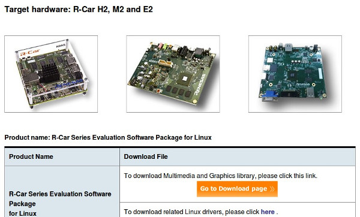

# Build an image for Porter board

In this section, we will go on the image compilation for the Porter
board within the Docker container.

## Download Renesas proprietary drivers

For the Porter board, we first need to download the proprietary drivers
from Renesas web site. The evaluation version of these drivers can be
found here:

[http://www.renesas.com/secret/r_car_download/rcar_demoboard.jsp](http://www.renesas.com/secret/r_car_download/rcar_demoboard.jsp)

under the **Target hardware: R-Car H2, M2 and E2** section:



Note that you have to register with a free account on MyRenesas and
accept the license conditions before downloading them. The operation is
fast and simple but nevertheless mandatory to access evaluation of non
open-source drivers for free.

Once you register, you can download two zip files: store them in a
directory visible from the container, for example in the directory
`$MIRRORDIR/proprietary-renesas-r-car` (`$MIRRORDIR` was created
previously in section [Start the container](#anchor-start-container) and adjust
the permissions. The zip files should then be visible from the inside of the
container in `/home/devel/mirror`:

```bash
$ chmod +r /home/devel/mirror/proprietary-renesas-r-car/*.zip
$ ls -l /home/devel/mirror/proprietary-renesas-r-car/
total 8220
-rw-r--r-- 1 1000 1000 6047383 Jul 11 11:03 R-Car_Series_Evaluation_Software_Package_for_Linux-20151228.zip
-rw-r--r-- 1 1000 1000 2394750 Jul 11 11:03 R-Car_Series_Evaluation_Software_Package_of_Linux_Drivers-20151228.zip
```

## Setup the build environment

We should first prepare the environment to build images.

This can be easily done thanks to a helper script named `prepare_meta`.
This script does the following:

- check for an updated version at
  [https://github.com/iotbzh/agl-manifest](https://github.com/iotbzh/agl-manifest)
- pull Yocto layers from git repositories, following a snapshot manifest
- setup build configuration (build/conf files)

The following options are available:

```bash
devel@bsp-devkit:~$ prepare_meta -h
prepare_meta [options]

Options:
 -f|--flavour <flavour[/tag_or_revision]>
   what flavour to us
   default: 'iotbzh'
   possible values: 'stable','unstable','testing', 'iotbzh' ... see agl-manifest git repository
 -o|--outputdir <destination_dir>
   output directory where subdirectories will be created: meta, build, ...
    default: current directory (.)
 -l|--localmirror <directory>
   specifies a local mirror directory to initialize meta, download_dir or sstate-cache
    default: none
 -r|--remotemirror <url>
   specifies a remote mirror directory to be used at build time for download_dir or sstate-cache
    default: none
 -p|--proprietary <directory>
   Directory containing Renesas proprietary drivers for RCar platform (2 zip files)
    default: none
 -e|--enable <option>
   enable a specific option
    available options: ccache, upgrade
 -d|--disable <option>
   disable a specific option
    available options: ccache, upgrade
 -t|--target <name>
   target platform
    default: porter
    valid options: intel-corei7-64, qemux86, qemux86-64, wandboard
 -h|--help
   get this help

Example:
  prepare_meta -f iotbzh/master -o /tmp/xdt -l /ssd/mirror -p /vol/xdt/proprietary-renesas-rcar/ -t porter
```

In our case, we can start it with the following arguments:

- build in `/xdt` (-o /xdt)
- build for porter board (`-t porter`)
- build the 'iotbzh' flavour (`-f iotbzh`), which contains the standard
  AGL layers + security and app framework. Flavours are stored in the
  agl-manifest repository.
- Use a local mirror (`-l <mirror path>`). This directory may
  contain some directories generated in a previous build: `downloads`,
  `sstate-cache`, `ccache`, `meta`. If found, the mirror directories
  will be specified in configuration files.
- specify proprietary drivers location (`-p <drivers path>`)

So we can run the helper script:

```bash
devel@bsp-devkit:~$ prepare_meta -o /xdt -t porter -f rel2.0 -l /home/devel/mirror/ -p /home/devel/mirror/proprietary-renesas-r-car/ -e wipeconfig
[...]
=== setup build for porter
Using proprietary Renesas drivers for target porter
=== conf: build.conf
=== conf: download caches
=== conf: sstate caches
=== conf: local.conf
=== conf: bblayers.conf.inc -> bblayers.conf
=== conf: porter_bblayers.conf.inc -> bblayers.conf
=== conf: bblayers_proprietary.conf.inc is empty
=== conf: porter_bblayers_proprietary.conf.inc is empty
=== conf: local.conf.inc is empty
=== conf: porter_local.conf.inc is empty
=== conf: local_proprietary.conf.inc is empty
=== conf: porter_local_proprietary.conf.inc is empty
=====================================================================

Build environment is ready. To use it, run:

# source /xdt/meta/poky/oe-init-build-env /xdt/build

then

# bitbake agl-demo-platform
```

Now, the container shell is ready to build an image for Porter.

## Launch the build

To start the build, we can simply enter the indicated commands:

```bash
devel@bsp-devkit:~$ . /xdt/build/agl-init-build-env
### Shell environment set up for builds. ###

You can now run 'bitbake <target>'

Common target are:

 agl-demo-platform

devel@bsp-devkit:/xdt/build$ bitbake agl-demo-platform
[snip]
NOTE: Tasks Summary: Attempted 5108 tasks of which 4656 didn't need to
be rerun and all succeeded.

Summary: There were 19 WARNING messages shown.
```

Without mirror, it will take a few hours to build all the required
component of the AGL distribution, depending on: your host machine CPU,
disk drives types and internet connection.

## Updating the local mirror

Optionally, at the end of the build, some directories may be synced to
the mirror dir, for future usage:

- `/xdt/meta`: contains all layers used to build AGL
- `/xdt/downloads`: download cache (avoid fetching source from remote sites)
- `/xdt/sstate-cache`: binary build results (avoid recompiling sources)

This can be done with the following command:

```bash
$ for x in meta downloads sstate-cache; do rsync -Pav \
   --delete /xdt/$x /home/devel/mirror/$x; done
```
