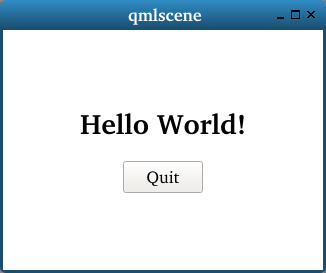
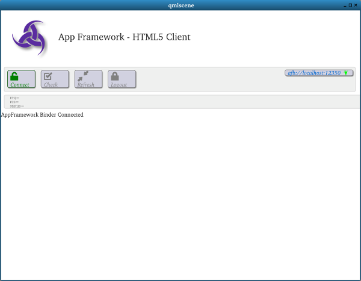
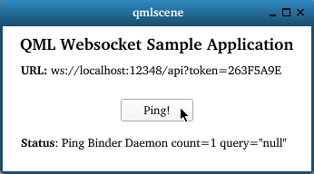
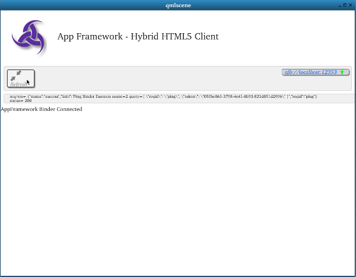

# Trying out the templates

In this section, we describe how to build the various templates, how to
package them and finally how to deploy and run them on the target board.

Every template is stored in a single directory and is independent of the
rest of the tree: each template can be used as a foundation for a fresh
new application.

For deployment, we assume that the target board is booted with an AGL
image and available on the network. Let us use the `BOARDIP` variable
for the board IP address (replace by appropriate address or hostname)
and test the SSH connection:
```
$ export BOARDIP=1.2.3.4
$ ssh root@$BOARDIP cat /etc/os-release
ID="poky-agl"
NAME="Automotive Grade Linux"
VERSION="1.0+snapshot-20160717 (master)"
VERSION_ID="1.0+snapshot-20160717"
PRETTY_NAME="Automotive Grade Linux 1.0+snapshot-20160717 (master)"
```

### Building

All operations are executed inside the Docker "Devkit" container. For
convenience, a build script named `build_all` can build all templates
at once. The following instructions allow to build each template
separately.

#### Service

Compile the Service:
```
$ cd ~/app-framework-templates/templates/service
$ mkdir build; cd build
$ cmake ..
-- The C compiler identification is GNU 5.2.0
[snip]
-- Configuring done
-- Generating done
-- Build files have been written to: /home/devel/app-framework-templates/templates/service/build

$ make
Scanning dependencies of target xxxxxx-service
[snip]
[100%] Generating xxxxxx-service.wgt
NOTICE: -- PACKING widget xxxxxx-service.wgt from directory package
[100%] Built target widget
```

This produced a `xxxxxx-service.wgt` package. Let us copy it to the
target:
```
$ scp xxxxxx-service.wgt root@$BOARDIP:~/
xxxxxx-service.wgt                           100%   24KB   24.3KB/s   00:00
```

#### Native application

Compile the Native application:
```
$ cd ~/app-framework-templates/templates/native
$ mkdir build; cd build
$ cmake ..
-- The C compiler identification is GNU 5.2.0
[snip]
-- Configuring done
-- Generating done
-- Build files have been written to: /home/devel/app-framework-templates/templates/native/build

$ make
Scanning dependencies of target xxxxxx-native
[ 33%] Building C object CMakeFiles/xxxxxx-native.dir/xxxxxx-native-client.c.o
[ 66%] Linking C executable xxxxxx-native
[ 66%] Built target xxxxxx-native
Scanning dependencies of target widget
[100%] Generating xxxxxx-native.wgt
NOTICE: -- PACKING widget xxxxxx-native.wgt from directory package
[100%] Built target widget
```

This produced a `xxxxxx-native.wgt` package. Let us copy it to the target:
```
$ scp xxxxxx-native.wgt root@$BOARDIP:~/
xxxxxx-native.wgt                             100%   15KB   15.2KB/s   00:00
```

#### QML application

Package the QML application:
```
$ cd ~/app-framework-templates/templates/qml
$ mkdir build; cd build
$ cmake ..
-- Creation of xxxxxx-qml for AFB-DAEMON
-- Configuring done
-- Generating done
-- Build files have been written to: /home/devel/app-framework-templates/templates/qml/build

$ make
Scanning dependencies of target widget
[100%] Generating xxxxxx-qml.wgt
NOTICE: -- PACKING widget xxxxxx-qml.wgt from directory package
[100%] Built target widget
```

This produced a `xxxxxx-qml.wgt` package. Again, copy it onto the target:
```
$ scp xxxxxx-qml.wgt root@$BOARDIP:~/
xxxxxx-qml.wgt                             100%   5852   5.7KB/s   00:00
```

#### HTML5 Application

For HTML5 applications, we first need to install Node.js and Gulp
(*remember: password for user 'devel' is 'devel'*):
```
$ curl -sL https://deb.nodesource.com/setup_6.x | sudo -E bash -
[snip]
$ sudo apt-get install nodejs
[snip]
$ sudo npm install --global gulp
[snip]
```

Then we need to install required Gulp dependencies to package this
particular HTML5 application, written in AngularJS and using Zurb
Foundation 6 for styling:
```
$ cd ~/app-framework-templates/templates/html5
$ npm install
[snip]
```

This can take some time as many Node.js modules are required.

We are then able to create the widget using the usual commands:
```
$ mkdir build; cd build
$ cmake ..
-- The C compiler identification is GNU 5.2.0
[snip]
-- Configuring done
-- Generating done
-- Build files have been written to: /home/devel/app-framework-templates/templates/html5/build

$ make
Scanning dependencies of target widget
[100%] Generating xxxxxx-html5.wgt
[16:46:23] Using gulpfile ~/app-framework-templates/templates/html5/gulpfile.js
[16:46:23] Starting 'build-app-prod'...
[16:46:28] gulp-imagemin: Minified 11 images (saved 35.13 kB - 8.8%)
[16:46:28] gulp-inject 1 files into index.html.
[16:46:28] gulp-inject 2 files into index.html.
[16:46:28] gulp-inject 1 files into index.html.
[16:46:28] gulp-inject 1 files into index.html.
[16:46:28] Finished 'build-app-prod' after 4.8 s
[16:46:28] Starting 'widget-config-prod'...
[16:46:28] Finished 'widget-config-prod' after 3.54 ms
NOTICE: -- PACKING widget xxxxxx-html5.wgt from directory package
[100%] Built target widget
```

This produced a `xxxxxx-html5.wgt` package. Let us copy it to the
target:
```
$ scp xxxxxx-html5.wgt root@$BOARDIP:~/
xxxxxx-html5.wgt                              100%   657KB   656.6KB/s   00:00
```

#### Hybrid QML Application

This application is composed of a UI written in QML and a specific binding
available though the binder.

Build and package the application:
```
$ cd ~/app-framework-templates/templates/hybrid-qml
$ mkdir build; cd build
$ cmake ..
-- The C compiler identification is GNU 5.2.0
[snip]
-- Creation of xxxxxx-hybrid-qml for AFB-DAEMON
-- Configuring done
-- Generating done
-- Build files have been written to: /home/devel/app-framework-templates/templates/hybrid-qml/build

$ make
Scanning dependencies of target xxxxxx-hybrid-qml
[ 33%] Building C object CMakeFiles/xxxxxx-hybrid-qml.dir/xxxxxx-hybrid-qml-binding.c.o
[ 66%] Linking C shared module xxxxxx-hybrid-qml.so
[ 66%] Built target xxxxxx-hybrid-qml
Scanning dependencies of target widget
[100%] Generating xxxxxx-hybrid-qml.wgt
NOTICE: -- PACKING widget xxxxxx-hybrid-qml.wgt from directory package
[100%] Built target widget
```

This produced a `xxxxxx-hybrid-qml.wgt` package. Let us copy it to the target:
```
$ scp xxxxxx-hybrid-qml.wgt root@$BOARDIP:~/
xxxxxx-hybrid-qml.wgt                           100%   13KB   12.7KB/s   00:00
```

#### Hybrid HTML5 Application

The same dependencies as for a "pure HTML5" application apply: we need
to install Gulp dependencies first:
```
$ cd ~/app-framework-templates/templates/hybrid-html5
$ npm install
[snip]
```

Then we can create the application:
```
$ mkdir build; cd build
$ cmake ..
[snip]
-- Build files have been written to: /home/devel/app-framework-templates/templates/hybrid-html5/build

$ make
Scanning dependencies of target xxxxxx-hybrid-html5
[snip]
Scanning dependencies of target widget
[snip]
NOTICE: -- PACKING widget xxxxxx-hybrid-html5.wgt from directory package
[100%] Built target widget
```

This produced a `xxxxxx-hybrid-html5.wgt` package. Let us copy it to the target:
```
$ scp xxxxxx-hybrid-html5.wgt root@$BOARDIP:~/
xxxxxx-hybrid-html5.wgt                       100%   660KB   660.2KB/s   00:00
```

### Installing on the target

And then, in a separate window, log in to the target board:
```
$ ssh root@$BOARDIP
```
and install our packages:
```
$ afm-util install xxxxxx-service.wgt
{ "added": "xxxxxx-service@0.1" }
$ afm-util install xxxxxx-native.wgt
{ "added": "xxxxxx-native@0.1" }
$ afm-util install xxxxxx-qml.wgt
{ "added": "xxxxxx-qml@0.1" }
$ afm-util install xxxxxx-html5.wgt
{ "added": "xxxxxx-html5@0.1" }
$ afm-util install xxxxxx-hybrid-qml.wgt
{ "added": "xxxxxx-hybrid-qml@0.1" }
$ afm-util install xxxxxx-hybrid-html5.wgt
{ "added": "xxxxxx-hybrid-html5@0.1" }
```

or alternatively, to install all packages at once:
```
$ for x in *.wgt; do afm-util install $x; done
```

We can verify that they were correctly installed by listing all
available applications:
```
$ afm-util list
[ { "id": "xxxxxx-service@0.1", "version": "0.1", "width": 0, "height":
0, "name": "App Framework - xxxxxx-service", "description": "This
service is used for ... (TODO: add description here)", "shortname": "",
"author": "John Doe <john.doe@example.com>" },
 { "id": "xxxxxx-hybrid-html5@0.1", "version": "0.1", "width": 0,
"height": 0, "name": "App Framework - xxxxxx-hybrid-html5",
"description": "This application is used for ... (TODO: add description
here)", "shortname": "", "author": "John Doe
<john.doe@example.com>" },
 { "id": "xxxxxx-html5@0.1", "version": "0.1", "width": 0, "height": 0,
"name": "App Framework - xxxxxx-html5", "description": "This application
is used for ... (TODO: add description here)", "shortname": "",
"author": "John Doe <john.doe@example.com>" },
 { "id": "xxxxxx-native@0.1", "version": "0.1", "width": 0, "height": 0,
"name": "App Framework - xxxxxx-native", "description": "This
application is used for ... (TODO: add description here)", "shortname":
"", "author": "John Doe <john.doe@example.com>" },
 { "id": "xxxxxx-hybrid-qml@0.1", "version": "0.1", "width": 0,
"height": 0, "name": "App Framework - xxxxxx-hybrid-qml", "description":
"This application is used for ... (TODO: add description here)",
"shortname": "", "author": "John Doe <john.doe@example.com>" },
 { "id": "xxxxxx-qml@0.1", "version": "0.1", "width": 0, "height": 0,
"name": "App Framework - xxxxxx-qml", "description": "This application
is used for ... (TODO: add description here)", "shortname": "",
"author": "John Doe <john.doe@example.com>" } ]
```

### Running the templates

Even if the templates are mostly skeleton applications, we can still
start them and see them in action.

All templates have been installed through the application framework, so
we will run them with the afm-util tool (only exception: Native
application - see explanations in chapter [Run a native application](#anchor-run-native_app)).

When the afm-user-daemon process receives a request to start an
application, it reads the application's `config.xml` configuration
file located in its specific directory
(`/usr/share/afm/applications/<appname>/<version>/config.xml`).
Depending on the specified MIME type (or the default Linux MIME type in
none was given), it then starts (an) appropriate process(es).

Final behavior is controlled by the global `/etc/afm/afm-launch.conf` config
file:
```
$ cat /etc/afm/afm-launch.conf
[snip]
application/vnd.agl.service
  /usr/bin/afb-daemon --ldpaths=/usr/lib/afb:%r/%c --mode=local
--readyfd=%R --alias=/icons:%I --port=%P --rootdir=%r/htdocs --token=%S
–sessiondir=%D/.afb-daemon

application/vnd.agl.native
  /usr/bin/afb-daemon --ldpaths=/usr/lib/afb:%r/lib --mode=local
--readyfd=%R --alias=/icons:%I --port=%P --rootdir=%r/htdocs --token=%S
--sessiondir=%D/.afb-daemon
  %r/%c %P %S

application/vnd.agl.qml
  /usr/bin/qt5/qmlscene -fullscreen -I %r -I %r/imports %r/%c

application/vnd.agl.qml.hybrid
  /usr/bin/afb-daemon --ldpaths=/usr/lib/afb:%r/lib --mode=local
--readyfd=%R --alias=/icons:%I --port=%P --rootdir=%r/htdocs --token=%S
--sessiondir=%D/.afb-daemon
 /usr/bin/qt5/qmlscene %P %S -fullscreen -I %r -I %r/imports %r/%c

application/vnd.agl.html.hybrid
  /usr/bin/afb-daemon --ldpaths=/usr/lib/afb:%r/lib --mode=local
--readyfd=%R --alias=/icons:%I --port=%P --rootdir=%r/htdocs --token=%S
--sessiondir=%D/.afb-daemon
  /usr/bin/web-runtime http://localhost:%P/%c?token=%S
[snip]
```

This file defines how various applications types are handled by the
application framework daemons.

#### Run a Service
<a id="anchor-run-as-service"></a>

Let us first run the Service:
```
$ afm-util run xxxxxx-service@0.1
1
```

Then confirm it is running:
```
$ afm-util ps
[ { "runid": 1, "state": "running", "id": "xxxxxx-service@0.1" } ]

$ ps -ef | grep afb
ps -ef|grep afb
root 848 650 0 17:34 ? 00:00:00 /usr/bin/afb-daemon
--ldpaths=/usr/lib/afb:/usr/share/afm/applications/xxxxxx-service/0.1/lib
--mode=local --readyfd=8 --alias=/icons /usr/share/afm/icons
--port=12345
--rootdir=/usr/share/afm/applications/xxxxxx-service/0.1/htdocs
--token=2F4DCA47
--sessiondir=/home/root/app-data/xxxxxx-service/.afb-daemon
```

We can see that an afb-daemon (Binder) process for this Service started
on port 12345 with security token 2F4DCA47, and that the directory
containing the shared library
(`/usr/share/afm/applications/xxxxxx-service/0.1/lib`) has been added
to the `--ldpaths` option. Please take note of your specific port and
security token, as we will re-use them in the next chapter.

A Service has no user interface, but we can still try the binding API.
Looking at the Service source code, we see that the Service implements
an API named '**xxxxxx**' providing a `ping` verb. Let us try this
using a simple REST request that will prove that the service is
functional:
```
$ web-runtime http://localhost:12345/api/xxxxxx/ping
```


#### Run a Native application
<a id="anchor-run-native_app"></a>

Now, let us see if our Native application is able to connect to the
previous Service using WebSockets capabilities.

Please note that the Native application we built is a console
application. For this reason, we won't start it through the application
framework because we need a text console to see its output. If the
Native application had been a visual one (say a Qt, GTK+ or EFL
application), we would have launched this app using the `afm-util start`
command.

First, let us make the application executable:
```
$ chmod +x
/usr/share/afm/applications/xxxxxx-native/0.1/xxxxxx-native
```

This Native application takes the following arguments:
- Service WebSocket URL (`ws://localhost:<PORT>/api?token=<TOKEN>`)
- API name (`xxxxxx` in our case)
- verb name (`ping` for instance)

Replace `PORT` and `TOKEN` with the appropriate values you noted during
[Run as Service chapter](#anchor-run-as-service), then run the application:
```
$ PORT=12345
$ TOKEN=2F4DCA47
$ /usr/share/afm/applications/xxxxxx-native/0.1/xxxxxx-native ws://localhost:$PORT/api?token=$TOKEN xxxxxx ping

ON-REPLY 1:xxxxxx/ping: {"response":"Some
String","jtype":"afb-reply","request":{"status":"success","info":"Ping
Binder Daemon tag=pingSample count=4 query=\"null\"","uuid":"72fdce2a-c029-4d3e-b03a-f564393cb65c"}}
```

#### Run a QML Application

For the QML Application, we can start it using afm-util:
```
$ afm-util start xxxxxx-qml@0.1
4
```

A new window should appear on the display, similar to this capture:



We can see that the application is running:
```
$ afm-util ps
[ { "runid": 1, "state": "running", "id": "xxxxxx-service@0.1" },
  { "runid": 4, "state": "running", "id": "xxxxxx-qml@0.1" } ]
```

Note that in this case, no Binder is started for the application. This
may change in the future depending on the security model chosen by AGL,
and how we want to handle Qt/QML apps.

When clicking on the Quit button, the application terminates and the
application framework daemon detects the end of the process:
```
$ afm-util ps
[ { "runid": 1, "state": "running", "id": "xxxxxx-service@0.1" } ]
```

#### Run a HTML5 Application

We can then start the HTML5 application:
```
$ afm-util start xxxxxx-html5@0.1
6
```

Its user interface looks like this:



Buttons allow to demonstrate default authentication API, provided by
"auth" binding.

Note that a Binder is started to support the HTML5 application (at least
to allow the webengine to download the static data: HTML page,
javascript code ...) even if the application doesn't provide any specific
binding.

#### Run a Hybrid QML Application

Let us start the hybrid QML application:
```
$ afm-util start xxxxxx-hybrid-qml@0.1**
7
```



The following UI appears:

In the hybrid-qml source code, the binding provides an API named
'**xxxxxx**' with a `ping` verb. When clicking on the "Ping!"
button, the QML client sends the "**xxxxxx/ping**" API call to the
Binder, which routes it to xxxxxx-hybrid-qml-binding and executes the
`ping` verb.

The status is updated by the response to the API call.

#### Run a Hybrid HTML5 Application

Finally, let us start the Hybrid HTML5 application:
```
$ afm-util start xxxxxx-hybrid-html5@0.1
7
```

The following UI appears:



This application uses the same binding as the Hybrid QML one. It also
demonstrates the same functionality: when clicking on the `Refresh`
button, it calls **xxxxxx/ping** on the binder and gets the result then
displays it.
