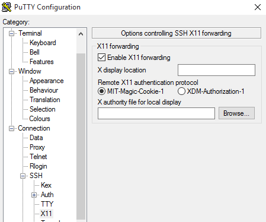

# Developing smoothly with the container

The previous chapter pretty much illustrated the virtues of the Docker
container by letting you compile AGL applications, independently of your
host machine.

There is one catch, though, in that the container does not feature a
full graphical environment similar to those which developers are used to.
But this can be circumvented.

For this reason, and before we start developing our own apps, we will
explain how to get the best from the provided development container.

### Remote display
<a id="anchor-remote-display"></a>

Apart from popular console tools such as `vi, git, patch, diff...` our
container also features graphical applications: `gvim` text editor,
`gitg` frontend for Git, `gvimdiff` ...

You can display them on your host machine by taking advantage of X11
protocol remoting capabilities. The procedure differs depending on your
host machine.

#### Linux

You have to connect to your container by specifying the `-X` option:
```
$ ssh -X -p 2222 devel@localhost
```
and then any graphical window, such as `gvim`'s, should display on your
host screen.

#### Mac OS X

You have to connect to your container by specifying the `-X` option:
```
$ ssh -X -p 2222 devel@localhost
```
together with a running X11 server such as XQuartz.

XQuartz was included in old versions such as 10.5 Leopard; you can find it
under `Applications -> Utilities -> X11`.
For more recent versions starting from 10.6.3, you may have to download and
install it from the following URL:
[https://dl.bintray.com/xquartz/downloads/XQuartz-2.7.9.dmg](https://dl.bintray.com/xquartz/downloads/XQuartz-2.7.9.dmg)
(it will end up in the same location).


And then after having activated the "X11" icon, any graphical window, such as
`gvim`'s, should display on your host screen.

#### Windows

You have to use PuTTY, as suggested in the previous "**Image and SDK
for porter**" document, together with a running X server such as Xming
([https://sourceforge.net/projects/xming/files/latest/download](https://sourceforge.net/projects/xming/files/latest/download)).

Before connecting with PuTTY as usual, you have to go
to `Connection -> SSH -> X11` and check the `Enable X11 forwarding` checkbox.



Then, if Xming is installed and running, as displayed
in the bottom right of the screen:


any graphical window, such as `gvim`'s, should display on your screen.


### Installing new applications (IDE...)

The container has access to the whole Linux Debian distribution library,
and can benefit of only package available for it.

For instance, to install the popular Eclipse IDE, please type:
```
$ sudo apt-get install eclipse
```
And then, using the method described in section ["Remote display"](anchor-remote-display),
you can run it on your host screen by just typing:
```
$ eclipse
```
